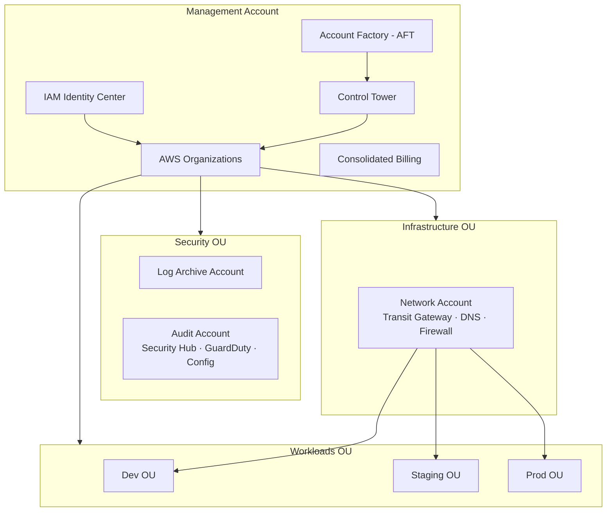

# CLAUDE.md — Cloud Landing Zone

> **MANDATORY — Before starting ANY task, read ALL THREE files in this order:**
> 1. `../CLAUDE.md` — Global MAIA standards (parent folder)
> 2. `CLAUDE.md` — This file
> 3. `CLAUDE.private.md` — Detailed implementation plan (local only, never commit)
>
> Do not start any work until all three files are fully read and understood.
> If CLAUDE.private.md is not found, ask Walid to provide it before proceeding.

---

> Project 01 of 18 — MAIA Portfolio  
> Part of the [multicloud-ai-architect](https://github.com/multicloud-ai-architect) organization.

---

## Mission

Build a comprehensive, well-documented AWS Landing Zone reference implementation.  
This project is primarily a **reference guide and architecture blueprint** — the Terraform code illustrates the concepts, it is not a production-ready deployment tool.

**The primary deliverable is `docs/landing-zone-reference.md`** — a complete reference guide covering every Landing Zone component with diagrams, best practices, real-world context, and ADRs.

---

## Scope

**v1 (Month 1-2)**: AWS Landing Zone — Organizations, Control Tower, SCPs, IAM Identity Center, Transit Gateway, Security Hub, GuardDuty, Config, CloudTrail, RAM, Cost Management.  
**v2 (Month 13-14)**: Multi-cloud extension — Azure Management Groups + GCP Organization + Aviatrix unified networking.

---

## Architecture Overview



---

## Tech Stack

```hcl
terraform {
  required_version = ">= 1.6.0"
  required_providers {
    aws = {
      source  = "hashicorp/aws"
      version = "~> 5.0"
    }
  }
}
```

**AWS Services covered**: Organizations, Control Tower, SCPs, Tag Policies, IAM Identity Center, Transit Gateway, VPC, RAM, Route 53 Resolver, Network Firewall, Security Hub, GuardDuty, Config, CloudTrail, Macie, Inspector, IAM Access Analyzer, Trusted Advisor, AWS Backup, Cost Explorer, Budgets, Systems Manager.

---

## Project Structure

```
cloud-landing-zone/
├── CLAUDE.md
├── README.md
├── LICENSE
├── CONTRIBUTING.md
├── .gitignore
├── .github/
│   └── workflows/
│       ├── lint.yml
│       └── terraform-plan.yml
├── terraform/
│   ├── modules/
│   │   ├── organizations/
│   │   ├── scp/
│   │   ├── control-tower/
│   │   ├── identity/
│   │   ├── networking/
│   │   ├── security/
│   │   ├── logging/
│   │   ├── cost-management/
│   │   └── resource-management/
│   └── environments/
│       └── sandbox/
├── docs/
│   ├── landing-zone-reference.md   ← PRIMARY DELIVERABLE
│   ├── diagrams/
│   └── adr/
│       ├── ADR-001-ou-structure.md
│       ├── ADR-002-scp-strategy.md
│       ├── ADR-003-sso-provider.md
│       ├── ADR-004-networking-pattern.md
│       ├── ADR-005-account-factory.md
│       ├── ADR-006-log-centralization.md
│       └── ADR-007-security-standards.md
└── examples/
```

---

## Roadmap

| Version | Scope | Status | Timeline |
|---------|-------|--------|----------|
| v1 | AWS Landing Zone — complete reference guide + illustrative Terraform | In Progress | Month 1-2 |
| v2 | Multi-cloud extension — Azure + GCP + Aviatrix | Planned | Month 13-14 |

---

## Important Note on Terraform Code

The Terraform modules in this project are **reference implementations**.  
They are designed to illustrate correct patterns in a sandbox context — not to deploy a production Landing Zone out of the box.

Every module includes comments explaining:
- What would differ in a real enterprise deployment
- What prerequisites are required
- What the sandbox simplifications are

**The documentation is the primary deliverable. The Terraform code illustrates it.**
