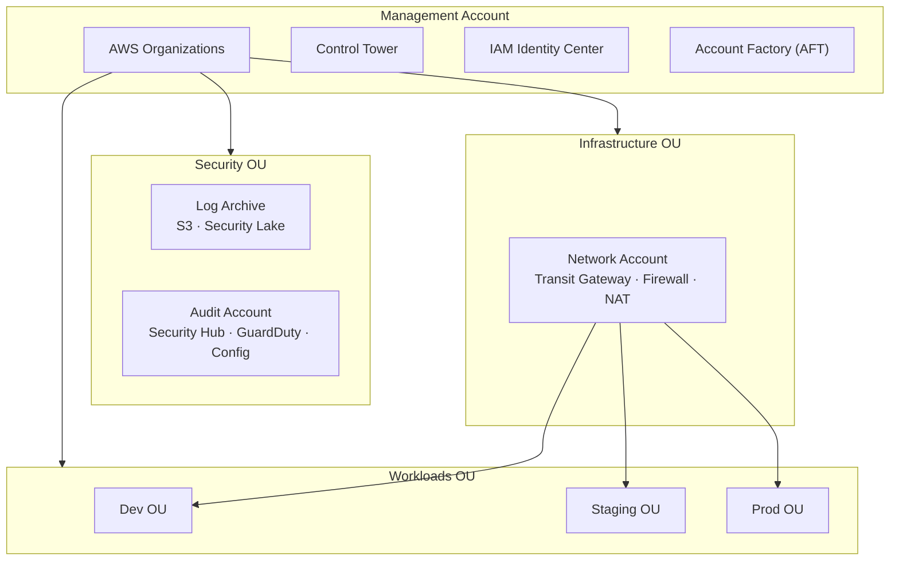

# Cloud Landing Zone

> Multi-account cloud landing zone — AWS v1, multi-cloud v2. Terraform modules, SCPs, Control Tower, Transit Gateway, Aviatrix.


## Overview

Multi-account cloud landing zone — AWS v1, multi-cloud v2. Terraform modules, SCPs, Control Tower, Transit Gateway, Aviatrix. This project is part of the MAIA — Multi-Cloud AI Architect portfolio, providing reference architectures and reusable building blocks for cloud architects working across AWS, Azure, and GCP.

The primary deliverable is [`docs/landing-zone-reference.md`](docs/landing-zone-reference.md) — a complete reference guide covering every Landing Zone component with diagrams, best practices, real-world context, and ADRs.

## Architecture



> Full diagrams: [docs/diagrams/landing-zone-overview.png](docs/diagrams/landing-zone-overview.png) · [docs/diagrams/ou-structure.png](docs/diagrams/ou-structure.png)

## Roadmap

| Version | Scope | Status | Phase |
|---------|-------|--------|-------|
| v1 | Organizations, OUs, SCPs — ADRs + reference guide | ✅ Complete | Phase 1 |
| v1 | Identity & Access — IAM Identity Center, permission sets | 🔄 Next | Phase 2 |
| v1 | Networking — Transit Gateway, VPC, DNS, Firewall | ⏳ Planned | Phase 3 |
| v1 | Security Services — GuardDuty, Security Hub, Config, Security Lake | ⏳ Planned | Phase 4 |
| v1 | Control Tower, AFT, Cost Management | ⏳ Planned | Phase 5 |
| v1 | Complete reference guide, README, LinkedIn/Medium drafts | ⏳ Planned | Phase 6 |
| v2 | Multi-cloud — Azure Management Groups + GCP + Aviatrix | ⏳ Planned | Month 13-14 |

## Getting Started

### What's available now (Phase 1 complete)

- **[Landing Zone Reference Guide](docs/landing-zone-reference.md)** — complete reference for Organizations, OU structure, and SCPs
- **[ADR-001 — OU Structure](docs/adr/ADR-001-ou-structure.md)** — hybrid domain/environment OU design with decision tree
- **[ADR-002 — SCP Strategy](docs/adr/ADR-002-scp-strategy.md)** — 10 mandatory SCPs with full JSON policies and rationale
- **[Architecture Diagrams](docs/diagrams/)** — draw.io source files + exported PNGs

### Read the reference guide

```bash
# Clone the repository
git clone https://github.com/multicloud-ai-architect/cloud-landing-zone.git
cd cloud-landing-zone

# Open the reference guide
open docs/landing-zone-reference.md
```

### Prerequisites (for Terraform — coming Phase 2+)

- AWS CLI configured with appropriate permissions
- Terraform >= 1.6.0
- An AWS management account with Organizations enabled

### Project structure

```
cloud-landing-zone/
├── docs/
│   ├── landing-zone-reference.md   ← Primary deliverable
│   ├── adr/                        ← Architecture Decision Records
│   │   ├── ADR-001-ou-structure.md
│   │   └── ADR-002-scp-strategy.md
│   └── diagrams/                   ← draw.io + PNG exports
├── terraform/                      ← Reference modules (coming Phase 2+)
└── README.md
```

## ADRs

| ADR | Title | Status |
|-----|-------|--------|
| [ADR-001](docs/adr/ADR-001-ou-structure.md) | OU Structure | ✅ Accepted |
| [ADR-002](docs/adr/ADR-002-scp-strategy.md) | SCP Strategy | ✅ Accepted |
| ADR-003 | SSO Provider Selection | ⏳ Phase 2 |
| ADR-004 | Networking Pattern | ⏳ Phase 3 |
| ADR-005 | Account Factory | ⏳ Phase 5 |
| ADR-006 | Log Centralization Strategy | ⏳ Phase 4 |
| ADR-007 | Security Hub Standards Selection | ⏳ Phase 4 |

## Contributing

See [CONTRIBUTING.md](CONTRIBUTING.md) for guidelines.

## License

MIT License — see [LICENSE](LICENSE) for details.

## Author

Walid Moussa — [GitHub](https://github.com/walidmoussa) · [LinkedIn](https://www.linkedin.com/in/walid-moussa-8626268b/)
