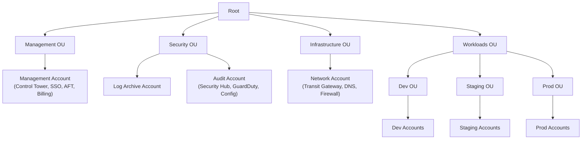
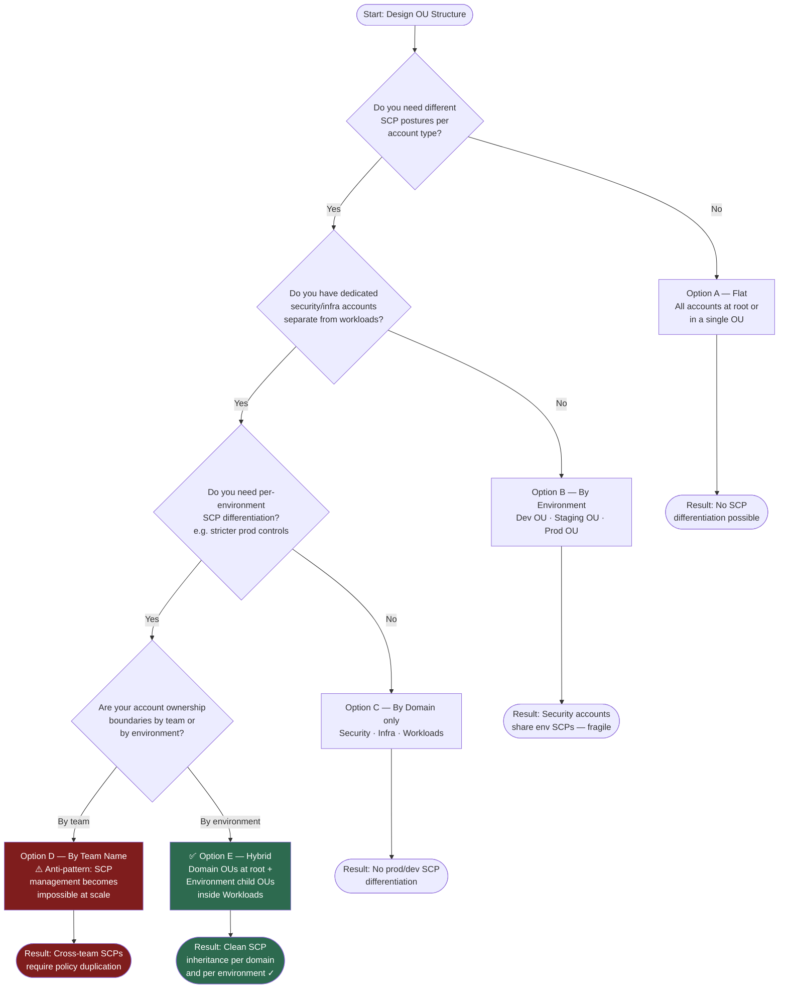

# ADR-001 — OU Structure

## Status

Accepted

## Date

2026-06-20

## Author

Walid Moussa — [GitHub](https://github.com/walidmoussa) · [LinkedIn](https://www.linkedin.com/in/walid-moussa-8626268b/)

## Context

AWS Organizations allows grouping accounts into Organizational Units (OUs). This grouping matters beyond
administrative tidiness: **OUs are the inheritance layer for Service Control Policies (SCPs)**. A policy
attached to an OU propagates down to every account inside it — which means a poor OU design makes SCP
management either impossible or dangerously broad.

Three patterns emerge in enterprise AWS deployments:

- **By environment** — root contains Dev OU, Staging OU, Prod OU. Intuitive for small teams but collapses
  as the organization grows: security accounts end up inside environment OUs, making it impossible to write
  SCPs that apply "to all accounts except security" without complex exclusions.

- **By domain** — root contains Security OU, Infrastructure OU, Workloads OU. Clean separation of concerns
  but no environment isolation at the top level; SCPs for prod-only controls require a different attachment
  strategy.

- **Hybrid** — domain-level OUs at the root (Security, Infrastructure, Workloads) with environment child
  OUs nested inside Workloads. This is the AWS Control Tower default and the pattern used by AWS Landing
  Zone Accelerator.

A critical constraint: **changing OU structure after accounts are provisioned is painful**. Moving an
account between OUs instantly changes which SCPs apply to it — this can inadvertently break running
workloads or open security gaps. The OU design must be decided before the first account is created.

A common anti-pattern seen in the field: teams create OUs by team name (OU-TeamA, OU-TeamB). This makes
SCP management nearly impossible because security controls cut across teams, not within them.



## Decision

Adopt the **hybrid structure**: domain-level OUs at the root, environment child OUs nested inside
Workloads.

```
Root
├── Management OU
│   └── Management Account (Control Tower, IAM Identity Center, AFT, Billing)
├── Security OU
│   ├── Log Archive Account
│   └── Audit Account
├── Infrastructure OU
│   └── Network Account
└── Workloads OU
    ├── Dev OU
    ├── Staging OU
    └── Prod OU
```

## Rationale

The hybrid structure enables the most precise SCP targeting:

- **Security OU** can have SCPs that deny deletion of security infrastructure (CloudTrail, GuardDuty) — and
  these SCPs apply even to the Security team's own accounts.
- **Infrastructure OU** can have SCPs that restrict which networking resources can be created — ensuring the
  Network account remains the sole owner of Transit Gateway.
- **Workloads/Prod OU** can have the strictest SCPs (no public S3, no unencrypted EBS) without affecting
  the Dev OU where developers may need more flexibility.
- The Management account stays outside all OUs at the root level under its own OU, following AWS best
  practices for Control Tower.

## Consequences

### Positive
- SCP inheritance is clean and predictable — each OU has a clear, distinct security posture
- Adding a new workload account requires only placing it in the correct environment OU — no SCP changes
- Security and infrastructure accounts are isolated from workload account SCPs
- Scales to hundreds of accounts without restructuring

### Negative
- More OUs to manage than a flat or by-environment-only structure
- New team members need to understand the domain/environment split to know where to place a new account
- Moving an account between Dev/Staging/Prod OUs during promotion requires careful SCP impact analysis

### Neutral
- Control Tower natively creates this structure — adopting it aligns with the AWS-managed baseline

## Decision Tree

How to arrive at the right OU structure given your organization's requirements:



## Alternatives Considered

### Option A — Flat Structure (single OU)
All accounts in one OU or at the root. Zero overhead to set up. Fails immediately when SCPs are
introduced: any SCP attached to the root applies to all accounts equally, including the management account
and security accounts. There is no way to differentiate security posture by account type.

### Option B — By Environment Only
Root contains Dev OU, Staging OU, Prod OU. Simple and intuitive. Breaks down when security and
infrastructure accounts need to be isolated: the Log Archive account would live inside an environment OU,
making it subject to environment-level SCPs that may not be appropriate for it.

### Option C — By Domain Only (no child environment OUs)
Security OU, Infrastructure OU, Workloads OU at the root — but no further nesting. Works well for
organizations that separate workloads by domain (team or product line) rather than by environment.
Rejected because it provides no environment-level SCP differentiation: a stricter SCP for production
cannot be applied without affecting dev workloads in the same Workloads OU.

### Option D — By Team Name
OU-TeamA, OU-TeamB, OU-Platform. Seen frequently in early-stage cloud adoptions. Makes it impossible to
write SCPs that cut across teams (e.g., "all production workloads must have encryption enforced") without
duplicating policies across every team OU. Does not scale.

## References
- [AWS Organizations Best Practices](https://docs.aws.amazon.com/organizations/latest/userguide/orgs_best-practices_mgmt-acct.html)
- [AWS Control Tower OU Structure](https://docs.aws.amazon.com/controltower/latest/userguide/aws-multi-account-landing-zone.html)
- [ADR-002 — SCP Strategy](ADR-002-scp-strategy.md)
