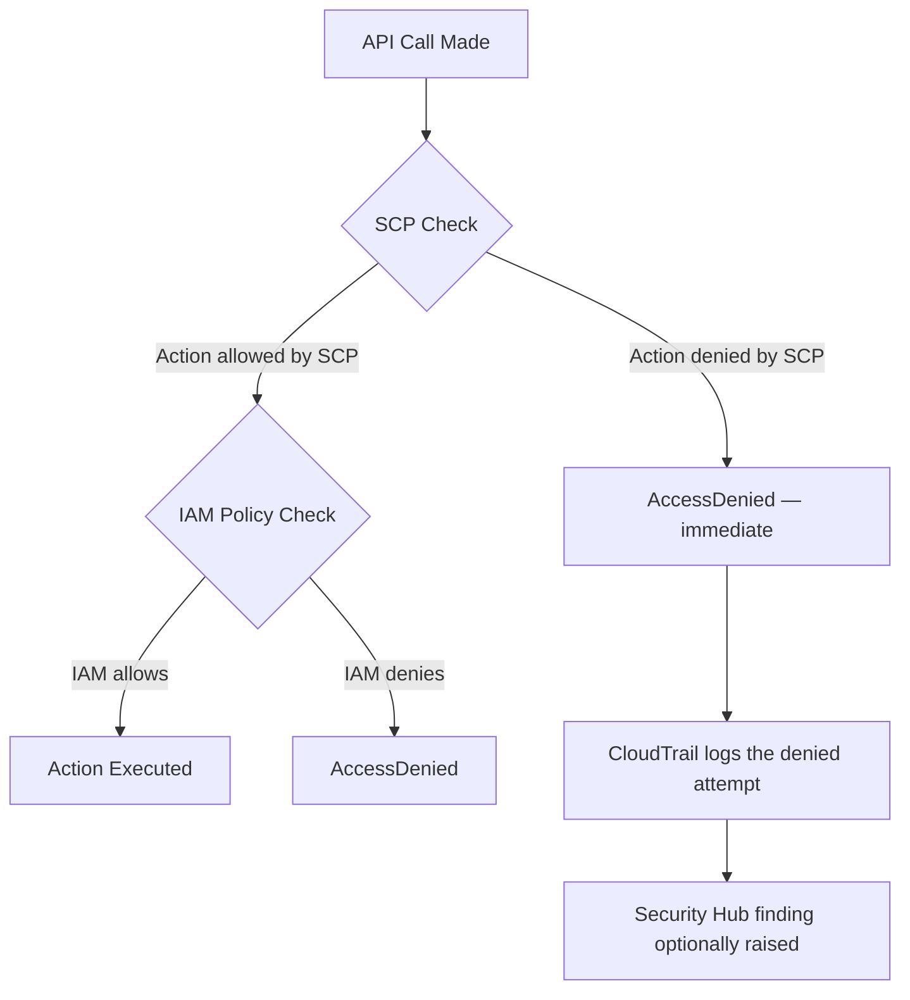

# ADR-002 — SCP Strategy

## Status

Accepted

## Date

2026-06-20

## Author

Walid Moussa — [GitHub](https://github.com/walidmoussa) · [LinkedIn](https://www.linkedin.com/in/walid-moussa-8626268b/)

## Context

Service Control Policies (SCPs) are the most powerful governance tool in AWS Organizations. They define
the **maximum permissions boundary** for every principal in every account they apply to — including the
account's root user and any Administrator-level IAM role. Even an IAM policy granting `*:*` cannot exceed
what the SCP allows.

This creates a fundamental choice: apply preventive controls early and strictly, or rely on detective
controls (Config rules, Security Hub findings) and fix violations after the fact.

The detective-only approach has a critical flaw: **detection is too late for some failure modes**. If an
attacker gains Administrator access to an account without SCPs, their first action is often to disable
GuardDuty and CloudTrail — the very services that would detect their activity. With those disabled, the
organization is blind. An SCP that prevents disabling GuardDuty stops this cold, regardless of IAM
permissions.

The common objection to early SCPs is the fear of lockout: "if we misconfigure an SCP, we block
ourselves." This fear is valid but manageable: SCPs can be tested in sandbox accounts before being applied
to production OUs, and the Management account is never subject to SCPs — it is always available as a
break-glass path.

The strategy below follows a **gradual library approach**: a small set of non-negotiable SCPs from day 1,
with additional policies added progressively as the organization's cloud maturity increases.



The 10 SCPs documented here represent the baseline that every AWS Landing Zone should enforce from the
first day of operation.

## Decision

Apply **preventive SCPs from day 1** across all OUs, using a gradual library approach. Start with the 5
most critical SCPs at launch; add the remaining 5 within the first 30 days as the team validates no false
positives in the sandbox.

The 10 mandatory SCPs, organized by criticality:

### Tier 1 — Day 1, non-negotiable

**1. DenyRootAccountUsage**
The root user of any AWS account has unconditional access that cannot be restricted by IAM policies or
SCPs. Using it for routine operations is a critical vulnerability — any credential leak grants total
control of the account. This SCP ensures root is only usable via the break-glass process with MFA and
audit trail.
```json
{
  "Effect": "Deny",
  "Action": "*",
  "Resource": "*",
  "Condition": {
    "StringLike": { "aws:PrincipalArn": "arn:aws:iam::*:root" }
  }
}
```

**2. DenyRegionsOutsideApproved**
Restricts all API calls to an approved list of AWS regions. Prevents workloads from being deployed in
regions that are outside the organization's data residency requirements (GDPR, data sovereignty). Also
reduces the attack surface: an attacker cannot spin up resources in an unmonitored region.
```json
{
  "Effect": "Deny",
  "NotAction": [
    "iam:*", "organizations:*", "support:*", "sts:*",
    "budgets:*", "cloudfront:*", "route53:*", "waf:*"
  ],
  "Resource": "*",
  "Condition": {
    "StringNotEquals": {
      "aws:RequestedRegion": ["eu-west-1", "eu-west-3", "us-east-1"]
    }
  }
}
```
Note: IAM, Organizations, Route 53, and a few global services must be excluded from the region deny —
they operate in `us-east-1` regardless of where the caller is.

**3. DenyDisableCloudTrail**
CloudTrail is the audit trail for every API call in the account. Disabling it destroys the evidence
needed to investigate incidents. An attacker's first step after gaining access is often to disable
CloudTrail to cover their tracks. This SCP makes that impossible.
```json
{
  "Effect": "Deny",
  "Action": [
    "cloudtrail:DeleteTrail",
    "cloudtrail:StopLogging",
    "cloudtrail:UpdateTrail"
  ],
  "Resource": "*"
}
```

**4. DenyDisableGuardDuty**
GuardDuty provides continuous threat detection by analyzing CloudTrail, VPC Flow Logs, and DNS logs. The
attacker pattern is well-documented: gain Admin access → disable GuardDuty → operate undetected. This SCP
closes that path. Apply to all OUs except the Security OU (where the Audit account may need to manage
GuardDuty centrally — handled via condition on principal ARN).
```json
{
  "Effect": "Deny",
  "Action": [
    "guardduty:DeleteDetector",
    "guardduty:DisassociateFromMasterAccount",
    "guardduty:StopMonitoringMembers",
    "guardduty:UpdateDetector"
  ],
  "Resource": "*"
}
```

**5. DenyLeaveOrganization**
Prevents any account from leaving the AWS Organization. An account that leaves the organization
immediately loses all SCP governance, all Config rules, all Security Hub integration, and all consolidated
billing. This is a catastrophic blast radius — it should require an explicit organizational process, not
a single API call.
```json
{
  "Effect": "Deny",
  "Action": "organizations:LeaveOrganization",
  "Resource": "*"
}
```

### Tier 2 — Within 30 days

**6. DenyDisableSecurityHub**
Security Hub aggregates findings from GuardDuty, Config, Inspector, Macie, and IAM Access Analyzer into
a single pane of glass. Disabling it doesn't stop threats — it stops visibility into them. The
aggregation value is only realized when Security Hub is always on across all accounts.
```json
{
  "Effect": "Deny",
  "Action": [
    "securityhub:DeleteHub",
    "securityhub:DisableSecurityHub"
  ],
  "Resource": "*"
}
```

**7. RequireS3Encryption**
Denies the creation of S3 buckets without server-side encryption and denies PutObject calls that
explicitly request no encryption. This is a belt-and-suspenders control: S3 default encryption exists
at the bucket level, but an SCP enforces it at the organizational level where it cannot be bypassed by
bucket owners.
```json
{
  "Effect": "Deny",
  "Action": "s3:PutObject",
  "Resource": "*",
  "Condition": {
    "StringEquals": {
      "s3:x-amz-server-side-encryption": "false"
    }
  }
}
```

**8. RequireEC2IMDSv2**
IMDSv1 (the EC2 Instance Metadata Service version 1) does not require session-oriented requests, making
it vulnerable to Server-Side Request Forgery (SSRF) attacks. An attacker who can make the application
server perform HTTP requests can retrieve the instance's IAM credentials via `http://169.254.169.254`.
IMDSv2 requires a PUT request with a session token first, blocking SSRF exploitation. The 2019 Capital
One breach used IMDSv1 as part of the attack chain.
```json
{
  "Effect": "Deny",
  "Action": "ec2:RunInstances",
  "Resource": "arn:aws:ec2:*:*:instance/*",
  "Condition": {
    "StringNotEquals": {
      "ec2:MetadataHttpTokens": "required"
    }
  }
}
```

**9. DenyPublicS3Buckets**
Denies the creation of public S3 buckets and the disabling of S3 Block Public Access at the account
level. S3 Block Public Access exists as an account-level setting, but it can be disabled by an IAM
administrator. This SCP prevents that. Note: this does not replace bucket-level policies — it adds an
organizational floor that cannot be removed.
```json
{
  "Effect": "Deny",
  "Action": [
    "s3:PutBucketPublicAccessBlock",
    "s3:DeletePublicAccessBlock"
  ],
  "Resource": "*",
  "Condition": {
    "StringEquals": {
      "s3:PublicAccessBlockConfiguration/BlockPublicAcls": "false"
    }
  }
}
```

**10. DenyUnencryptedEBS**
Denies the creation of EBS volumes without encryption. Unencrypted EBS volumes expose data at rest and
often violate compliance requirements (PCI DSS, HIPAA, SOC 2). AWS supports EBS encryption by default
at the region level, but this SCP enforces it as an organizational control that cannot be bypassed by
disabling the regional setting.
```json
{
  "Effect": "Deny",
  "Action": "ec2:CreateVolume",
  "Resource": "*",
  "Condition": {
    "Bool": { "ec2:Encrypted": "false" }
  }
}
```

## Rationale

Preventive controls are the only way to guarantee a security baseline. Detective controls are valuable
for anomaly detection and compliance reporting, but they cannot undo a misconfiguration that has already
caused data exposure or audit trail destruction.

The gradual library approach (Tier 1 on day 1, Tier 2 within 30 days) reduces deployment risk: the Tier 1
SCPs are binary controls with no false positives in legitimate workloads. The Tier 2 SCPs require
validation that existing workloads don't rely on the denied patterns (e.g., IMDSv1 on legacy EC2
instances).

## Consequences

### Positive
- Security baseline is enforced regardless of IAM configuration in member accounts
- Disabling security services (GuardDuty, CloudTrail, Security Hub) is impossible from any member account
- Root account usage is blocked organizationally, not just by policy convention
- Compliance evidence is straightforward: SCPs are in place, violations are structurally prevented

### Negative
- Tier 2 SCPs require validation against existing workloads before rollout — EC2 instances using IMDSv1
  will fail to launch once `RequireEC2IMDSv2` is active
- Region restriction SCP needs updating when the organization expands to new regions
- Development teams may encounter unexpected AccessDenied errors if they are unaware of active SCPs —
  requires documentation and onboarding communication

### Neutral
- SCP changes require Organizations admin permissions (management account) — this is a feature, not a
  limitation: it enforces a change control process for governance policies

## Alternatives Considered

### Option A — No SCPs (IAM only)
Rely entirely on IAM policies within each account. An account with a compromised Administrator role has
no organizational guardrail. Security services can be disabled. The account can leave the organization.
Root can be used without restriction. Not acceptable as a baseline.

### Option B — Detective Only (Config rules + Security Hub)
Apply Config conformance packs and Security Hub standards that alert on violations but do not prevent
them. Findings are raised after the fact. For controls like "do not disable CloudTrail," detection after
disablement means the audit trail is already gone. Detection latency (minutes to hours) is unacceptable
for these critical controls.

### Option C — Preventive from Day 1 (chosen)
Accept the upfront complexity of designing and testing SCPs before deployment. Use the Management account
as a break-glass path that is never subject to SCPs. Validate each SCP in a sandbox OU before attaching
to production OUs. This is the only approach that provides a guaranteed organizational security floor.

## References
- [AWS SCP Examples](https://docs.aws.amazon.com/organizations/latest/userguide/orgs_manage_policies_scps_examples.html)
- [AWS Security Blog — Establishing a Preventive Security Baseline](https://aws.amazon.com/blogs/security/)
- [Capital One breach — IMDSv1 SSRF](https://www.capitalone.com/digital/facts2019/)
- [ADR-001 — OU Structure](ADR-001-ou-structure.md)
- [ADR-007 — Security Hub Standards Selection](ADR-007-security-standards.md)
