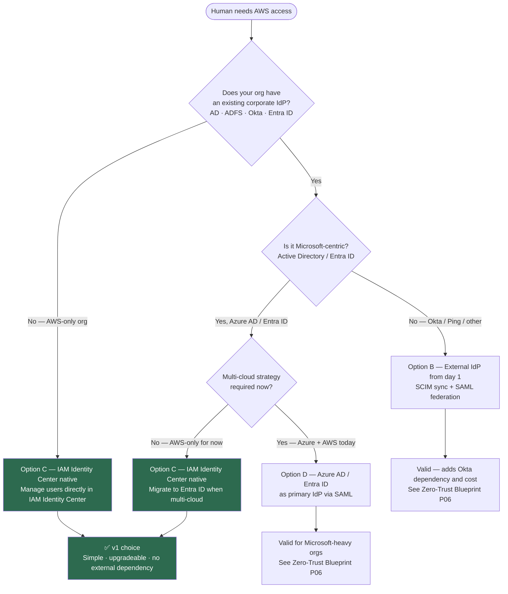

# ADR-003 — SSO Provider Selection

## Status

Accepted

## Date

2026-06-20

## Author

Walid Moussa — [GitHub](https://github.com/walidmoussa) · [LinkedIn](https://www.linkedin.com/in/walid-moussa-8626268b/)

## Context

Every AWS account has its own IAM user store. Without SSO, teams create IAM users per account — which
means separate credentials per account, no centralized access revocation, no audit trail of who accessed
what across the organization, and no consistent MFA enforcement. At 10 accounts this is manageable. At
50 accounts it becomes a security liability. At 100+ accounts it is operationally impossible.

AWS IAM Identity Center (formerly AWS SSO) solves this by providing a single entry point for human
access across all accounts in the organization. It can operate in two modes:

**Native IdP mode**: IAM Identity Center manages users and groups itself. Appropriate for organizations
that do not have an existing corporate directory, or for AWS-only environments where a separate enterprise
IdP is not yet required.

**External IdP relay mode**: IAM Identity Center acts as a relay — it delegates authentication to an
external Identity Provider (Okta, Azure Active Directory / Entra ID, ADFS, Ping Identity) via SAML 2.0
or SCIM. Users authenticate against their existing corporate directory and IAM Identity Center handles
the AWS-side permission mapping. This is the correct pattern for enterprises that already manage
identities in Active Directory or an existing cloud IdP.

Most organizations that adopt this Landing Zone reference will eventually need external IdP federation
— they already have Active Directory, or they are moving toward a multi-cloud identity strategy that
requires a single corporate IdP. The v1 choice (native IdP) is deliberately simple and upgradeable:
the permission set structure remains identical when federating to an external IdP; only the user source
changes.

## Decision

**v1**: Use IAM Identity Center as the native IdP. Manage users and groups directly in IAM Identity
Center. Apply 6 permission sets that map roles to accounts following least-privilege principles.

**v2**: When multi-cloud SSO is required (Azure + GCP + AWS) or when an existing enterprise IdP must
be integrated, federate IAM Identity Center to an external IdP via SCIM + SAML. This migration path
is covered in the **Zero-Trust Blueprint** project (MAIA Portfolio — Project 06).

### Permission Sets

Permission sets define what a user can do in a target account. They are assigned to groups, not
individuals — role-based access, not person-based access.

| Permission Set | Base policy | Accounts | Who |
|----------------|-------------|---------- |-----|
| `AdministratorAccess` | `AdministratorAccess` | Management, Security, Network accounts only | Platform team leads — break-glass only |
| `PowerUserAccess` | `PowerUserAccess` | Dev OU accounts | Developers — no IAM write |
| `ReadOnlyAccess` | `ReadOnlyAccess` | All accounts | Auditors, new team members (default) |
| `DeveloperAccess` | Custom — EC2, ECS, Lambda, S3, RDS, CloudWatch | Dev OU accounts only | Developers — scoped to dev services |
| `SecurityAuditAccess` | `SecurityAudit` + `ViewOnlyAccess` | All accounts | Security team — read all security services |
| `BillingAccess` | `Billing` | Management account only | FinOps team |

**Key constraints:**
- No human has `AdministratorAccess` in Prod workload accounts — changes go through IaC pipelines
- `SecurityAuditAccess` is read-only across all accounts — cannot modify or delete anything
- `BillingAccess` is restricted to the Management account — prevents cost data leakage

## Rationale

IAM Identity Center native was chosen for v1 because:

1. **Zero external dependencies** — no Okta license, no ADFS infrastructure, no SCIM endpoint to maintain
2. **Upgradeable without rebuilding** — switching to an external IdP later only changes the user source;
   all permission sets, account assignments, and group mappings transfer unchanged
3. **AWS-native audit trail** — all access events appear in CloudTrail automatically; no additional
   integration required
4. **SCIM auto-provisioning ready** — when an external IdP is added, SCIM can sync users/groups
   automatically without manual user management

## Consequences

### Positive
- Single sign-on across all AWS accounts from day one
- Centralized access revocation — remove a user once, lose access everywhere
- MFA enforced at the IAM Identity Center level — applies to all accounts
- Full audit trail in CloudTrail — every console login and CLI session is logged with the user's identity
- Permission sets are reusable — one definition applies to multiple accounts

### Negative
- IAM Identity Center native requires manual user management — no automatic sync from HR systems
  (mitigated: SCIM integration with external IdP resolves this in v2)
- IAM Identity Center is a regional service with a home region — choosing it requires a deliberate
  regional decision (recommend `us-east-1` or the primary AWS region for the organization)
- Local users cannot use the IAM Identity Center native IdP when external IdP federation is enabled —
  plan the migration before cutting over

### Neutral
- IAM Identity Center does not replace IAM roles — it vends temporary credentials via IAM roles in each
  account. IAM roles still exist; Identity Center controls who can assume them.
- Permission sets map 1:1 to IAM roles created in target accounts by IAM Identity Center automatically

## Alternatives Considered

### Option A — IAM users per account (no SSO)
Each AWS account has its own set of IAM users with long-term access keys. No central management.
Access revocation requires logging into each account individually. MFA is optional per user. No
cross-account visibility. Fails at scale — unmanageable at 10+ accounts, a security liability at 50+.
Rejected unconditionally.

### Option B — External IdP from day 1 (Okta)
Valid for organizations that already have Okta. Adds a hard dependency on Okta availability — if Okta
is down, AWS access is down. Requires SCIM endpoint configuration and Okta license cost. Appropriate
when Okta is already the enterprise standard. Deferred to v2 / Zero-Trust Blueprint project.

### Option C — IAM Identity Center native (chosen for v1)
Simple, AWS-native, no external dependencies. Upgradeable to external IdP without rebuilding permission
sets. The correct choice for AWS-only organizations and as a starting point before enterprise IdP
integration.

### Option D — Azure AD / Entra ID as primary IdP
Valid for Microsoft-heavy organizations running Azure + AWS. Entra ID as the single IdP across both
clouds is architecturally clean. Requires Azure AD Premium P1+ and SAML/SCIM configuration. Covered
in the Zero-Trust Blueprint project (MAIA Portfolio — Project 06) where multi-cloud identity
federation is the primary topic.

## References

- [AWS IAM Identity Center documentation](https://docs.aws.amazon.com/singlesignon/latest/userguide/)
- [IAM Identity Center SCIM provisioning](https://docs.aws.amazon.com/singlesignon/latest/userguide/provision-automatically.html)
- [ADR-001 — OU Structure](ADR-001-ou-structure.md)
- [ADR-002 — SCP Strategy](ADR-002-scp-strategy.md)
- Zero-Trust Blueprint — MAIA Portfolio Project 06 (planned — Month 13-14)