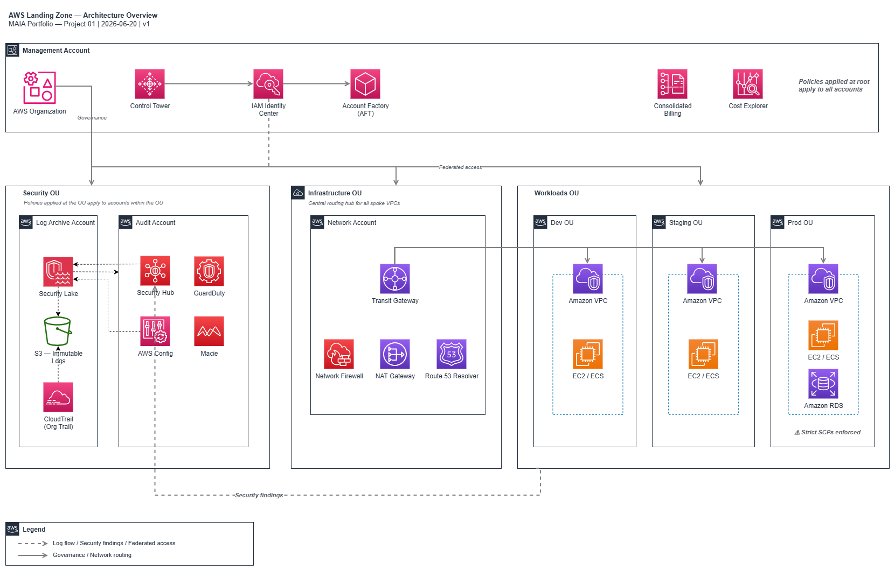
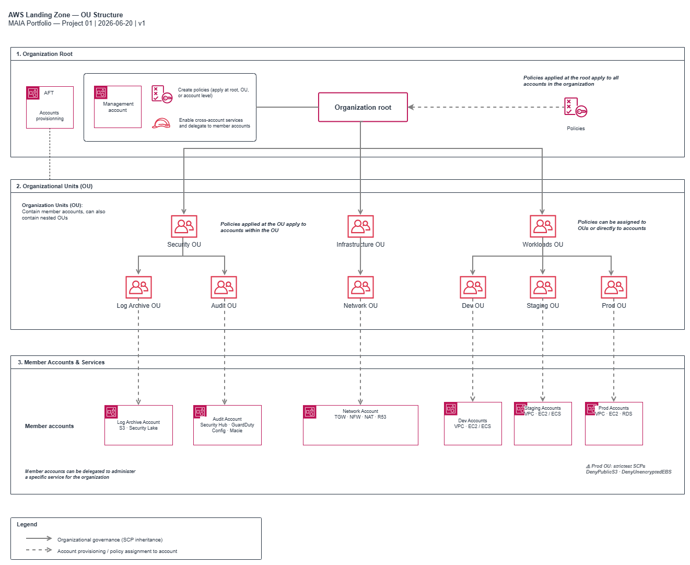
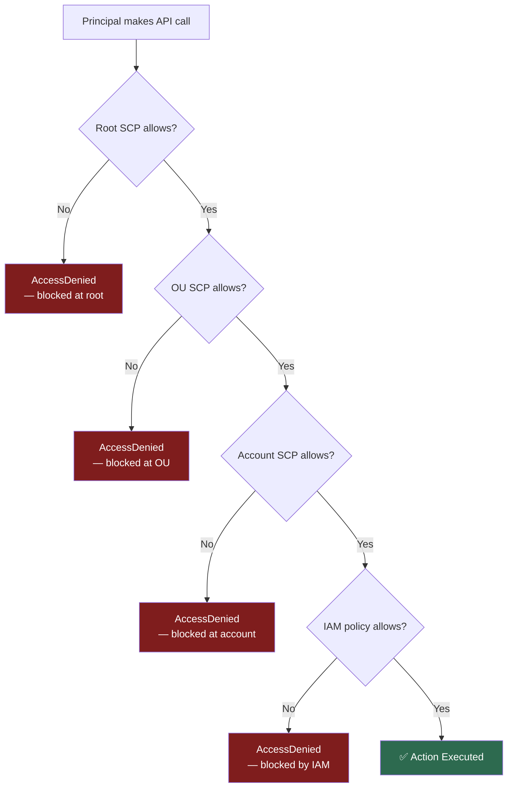
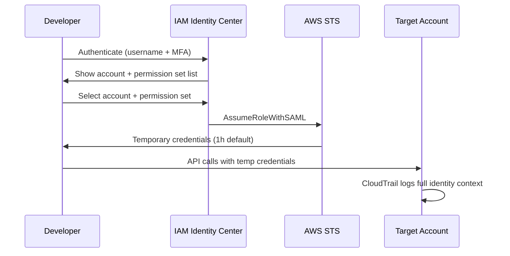

# AWS Landing Zone — Complete Reference Guide

> **Author**: Walid Moussa — [GitHub](https://github.com/walidmoussa) · [LinkedIn](https://www.linkedin.com/in/walid-moussa-8626268b/)
> **Project**: MAIA Portfolio — Project 01/18
> **Last updated**: 2026-06-20

---

## Table of Contents

- [Introduction](#introduction)
- [Design Principles](#design-principles)
- [Architecture Overview](#architecture-overview)
- [Chapter 1 — Organizations & OU Structure](#chapter-1--organizations--ou-structure)
- [Chapter 2 — Service Control Policies (SCPs)](#chapter-2--service-control-policies-scps)
- [Chapter 3 — Control Tower & Guardrails](#chapter-3--control-tower--guardrails) _(coming — Phase 5)_
- [Chapter 4 — Account Factory (AFT)](#chapter-4--account-factory-aft) _(coming — Phase 5)_
- [Chapter 5 — Identity & Access](#chapter-5--identity--access) _(coming — Phase 2)_
- [Chapter 6 — Networking](#chapter-6--networking) _(coming — Phase 3)_
- [Chapter 7 — Security Services](#chapter-7--security-services) _(coming — Phase 4)_
- [Chapter 8 — Log Management](#chapter-8--log-management) _(coming — Phase 4)_
- [Chapter 9 — Cost Management](#chapter-9--cost-management) _(coming — Phase 5)_
- [Chapter 10 — Resource Management](#chapter-10--resource-management) _(coming — Phase 5)_
- [Chapter 11 — Automation & Operations](#chapter-11--automation--operations) _(coming — Phase 6)_
- [Chapter 12 — Disaster Recovery & Resilience](#chapter-12--disaster-recovery--resilience) _(coming — Phase 6)_
- [Deployment Guide](#deployment-guide) _(coming — Phase 6)_
- [Validation Checklist](#validation-checklist) _(coming — Phase 6)_
- [ADR Index](#adr-index)
- [References](#references)

---

## Introduction

### What is a Landing Zone?

A Landing Zone is the **foundational layer of your AWS environment** — the set of accounts, policies,
guardrails, networking, and identity controls that must exist before any workload is deployed. It is not
a single AWS service. It is an architecture pattern implemented across multiple AWS services working in
concert.

Think of it as the foundation of a building. You do not pour the foundation after the walls go up. You
design it first, build it first, and everything else sits on top of it. Organizations that skip this step
— deploying workloads directly into a single AWS account with no guardrails — inevitably reach a point
where they must stop, rebuild the foundation beneath running production systems, and migrate everything.
That migration is painful, expensive, and risky. A Landing Zone built correctly from day one avoids it
entirely.

A well-designed Landing Zone gives you:

- **Governance at scale** — Service Control Policies that apply across hundreds of accounts without
  manual configuration on each
- **Security by default** — GuardDuty, CloudTrail, Config, and Security Hub active in every account
  from the moment it is provisioned
- **Cost visibility** — consolidated billing with account-level cost allocation from day one
- **Identity consistency** — a single entry point for all human access across all accounts, with
  least-privilege permission sets
- **Network control** — centralized routing, DNS, and egress inspection rather than each account
  managing its own internet gateway

### Who This Guide Is For

This guide is written for:

- **Cloud architects** designing an AWS environment for an organization that is scaling beyond a single
  account
- **Platform engineering teams** tasked with building the shared infrastructure that product teams
  deploy onto
- **CTOs and engineering managers** evaluating what it takes to build a production-ready AWS foundation
- **Cloud engineers** who have heard "we need a Landing Zone" and need to understand what that actually
  means in practice

It assumes familiarity with basic AWS concepts (accounts, IAM, VPCs) but does not assume prior
Landing Zone experience.

### How to Use This Guide

Each chapter follows the same structure:

1. **What it is** — definition and purpose
2. **Why it matters** — what goes wrong without it
3. **When to use it** — maturity level and organizational context
4. **How it works** — architecture with diagrams
5. **Our design decision** — link to the ADR
6. **Terraform implementation** — reference module walkthrough
7. **Pitfalls & Best Practices** — real-world lessons

Read sequentially for a complete picture, or jump to individual chapters for specific components.
The Terraform code in each chapter is a **reference implementation** — it illustrates the pattern
in a sandbox context. See the note in each module's header for what differs in a production deployment.

### Relationship to AWS Well-Architected Framework

The AWS Well-Architected Framework defines six pillars: Operational Excellence, Security, Reliability,
Performance Efficiency, Cost Optimization, and Sustainability. A Landing Zone is the structural
foundation that makes all six pillars achievable at scale:

| Pillar                 | Landing Zone component that enables it                           |
| ---------------------- | ---------------------------------------------------------------- |
| Security               | SCPs, GuardDuty, Security Hub, CloudTrail, IAM Identity Center   |
| Operational Excellence | Control Tower guardrails, AFT account vending, Config rules      |
| Reliability            | Multi-account isolation, Transit Gateway redundancy, DR patterns |
| Cost Optimization      | Consolidated billing, Budget alerts, Cost allocation tags        |
| Performance Efficiency | Centralized networking, PrivateLink, Transit Gateway routing     |
| Sustainability         | Tag policies enforcing cost attribution, rightsizing visibility  |

---

## Design Principles

These principles inform every architectural decision in this Landing Zone. When two valid approaches
conflict, these principles are the tiebreaker.

### 1. Least Privilege by Default

Every principal — human or machine — starts with zero permissions and gains only what is explicitly
required. IAM roles are scoped to the minimum set of actions on the minimum set of resources. Permission
sets in IAM Identity Center are defined for roles, not individuals. SCPs define the organizational ceiling
that no IAM policy can exceed.

_In practice_: a developer deploying to a Dev account has `PowerUserAccess` (no IAM modifications). The
same developer has `ReadOnlyAccess` in Prod. Neither has access to the Security or Network accounts.

### 2. Automation First — Everything Is Code

No account is created manually. No SCP is applied by clicking through the console. No permission set is
configured by hand. Every configuration is expressed in Terraform (or AFT pipelines), committed to Git,
and applied through a pipeline. This ensures reproducibility, auditability, and the ability to rebuild
the entire environment from scratch.

_In practice_: adding a new AWS account is a Pull Request. The PR is reviewed, merged, and AFT provisions
the account with the correct baseline automatically. The audit trail is the Git history.

### 3. Defense in Depth — Multiple Layers

No single control is relied upon as the sole line of defense. SCPs prevent unauthorized actions at the
organizational level. IAM policies enforce least privilege at the account level. Config rules detect
drift. Security Hub aggregates findings across all layers. GuardDuty monitors for behavioral anomalies.

_In practice_: even if an IAM policy is misconfigured to grant broad permissions, the SCP limits what
those permissions can actually do. Even if an SCP is missing a control, Config detects the violation.

### 4. Cost Visibility from Day 1

Cost allocation tags are mandatory on all resources. Budgets are configured per OU and per account before
any workload is deployed. Cost Explorer is enabled at the management account level. The rule is: if you
cannot attribute a cost to a team, a project, and an environment, that resource should not exist.

_In practice_: every EC2 instance, every RDS database, every NAT Gateway has `Project`, `Environment`,
`Team`, and `ManagedBy` tags. Monthly cost reports break down to the account level automatically.

### 5. Separation of Concerns — Dedicated Accounts per Function

Security tooling lives in dedicated accounts (Log Archive, Audit) that workload teams cannot touch.
Networking infrastructure lives in a dedicated Network account. Billing management lives in the
Management account. Each account boundary is a blast radius boundary: a compromised workload account
cannot affect the security tooling in the Audit account.

_In practice_: a developer who gains unintended Admin access to a Dev workload account cannot disable
GuardDuty in the Audit account, cannot delete logs in the Log Archive account, and cannot modify
Transit Gateway routing in the Network account.

### 6. Immutable Audit Trail

Every API call across every account is logged by the organization-level CloudTrail trail to an immutable
S3 bucket in the Log Archive account. SCPs prevent disabling CloudTrail from any member account. The
Log Archive account has SCPs preventing deletion or modification of log data. Compliance evidence is
always available, regardless of what happens in individual accounts.

---

## Architecture Overview

The Landing Zone spans multiple AWS accounts organized into Organizational Units. The diagram below shows
the full topology — accounts, services, and relationships.

> Full architecture diagram: `docs/diagrams/landing-zone-overview.png`
> _(Generate from `docs/diagrams/landing-zone-overview.drawio` — export to PNG in draw.io desktop)_



### Account Map

| Account             | OU                     | Purpose                                                                                                                                                                                                                |
| ------------------- | ---------------------- | ---------------------------------------------------------------------------------------------------------------------------------------------------------------------------------------------------------------------- |
| Management          | Root                   | Organizations, Control Tower, IAM Identity Center, AFT, Billing                                                                                                                                                        |
| Log Archive         | Security OU            | Immutable log storage — raw S3 logs (CloudTrail, Config, VPC Flow) + Amazon Security Lake (OCSF normalised). No direct human access — queried from Audit Account via Security Lake subscriber or Athena cross-account. |
| Audit               | Security OU            | Security Hub aggregator, GuardDuty delegated admin, Config aggregator (real-time + Advanced Queries). Security team queries Log Archive via Security Lake subscriber (modern) or Athena cross-account (classic).       |
| Network             | Infrastructure OU      | Transit Gateway, Network Firewall, centralized NAT, Route 53 Resolver                                                                                                                                                  |
| Dev workload(s)     | Workloads / Dev OU     | Application development environments                                                                                                                                                                                   |
| Staging workload(s) | Workloads / Staging OU | Pre-production environments                                                                                                                                                                                            |
| Prod workload(s)    | Workloads / Prod OU    | Production environments                                                                                                                                                                                                |

---

## Chapter 1 — Organizations & OU Structure

### What It Is

AWS Organizations is the service that groups AWS accounts under a single management account. It enables
consolidated billing, centralized policy management via SCPs, and organization-level enablement of
security services (CloudTrail, GuardDuty, Config, Security Hub) across all member accounts.

An **Organizational Unit (OU)** is a logical container for accounts within Organizations. OUs can be
nested. Policies (SCPs, Tag Policies, Backup Policies) attached to an OU propagate to all accounts
within that OU and all child OUs — this is the inheritance model that makes centralized governance
practical at scale.

### Why It Matters

Without AWS Organizations, each AWS account is an isolated silo. You cannot:

- Apply a policy that prevents any account from disabling CloudTrail
- Get a consolidated view of costs across accounts
- Enable GuardDuty across 50 accounts without logging into each one
- Prevent an account from leaving your billing structure

The moment an organization has more than one AWS account — which should be from day one — Organizations
is the required foundation.

### When to Use It

Always. There is no valid architecture pattern for multiple AWS accounts that does not use Organizations.
Even a two-account setup (management + workload) benefits from Organizations: consolidated billing alone
justifies it, and it enables future growth without structural rework.

### How It Works

The Organizations hierarchy has three levels:

```
Root
└── OUs (can be nested)
    └── Accounts
```

The **Root** is the top of the hierarchy. Policies attached to the Root apply to every account in the
organization — use this only for truly universal controls.

**OUs** are the governance boundaries. The OU structure is the most important design decision in a
Landing Zone — it determines how SCPs can be targeted and what blast radius boundaries exist. See
[ADR-001 — OU Structure](adr/ADR-001-ou-structure.md) for the full decision rationale.

**Accounts** are the actual AWS accounts. An account belongs to exactly one OU at any time. Moving it
changes which SCPs apply instantly.

> Full OU hierarchy diagram: `docs/diagrams/ou-structure.png`



### Our Design Decision

We chose a **hybrid structure**: domain-level OUs at the root (Security, Infrastructure, Workloads) with
environment child OUs (Dev, Staging, Prod) nested inside Workloads.

This enables two independent axes of SCP targeting:

- **By domain**: apply security posture rules to Security OU, networking rules to Infrastructure OU
- **By environment**: apply strict production controls to Workloads/Prod OU without affecting Dev OU

→ Full rationale and alternatives evaluated in [ADR-001 — OU Structure](adr/ADR-001-ou-structure.md)

### Terraform Implementation

```hcl
# ============================================================
# REFERENCE IMPLEMENTATION — Sandbox only
# In a real production deployment:
# - Organizations must be enabled via the console on the management account first
# - Control Tower creates the Security OU, Log Archive, and Audit accounts automatically
# - The Management account cannot be a member account — it is always the management account
# - Child OUs under Workloads are created as workload teams onboard, not upfront
# See docs/landing-zone-reference.md — Chapter 1 for full context.
# ============================================================

resource "aws_organizations_organization" "main" {
  aws_service_access_principals = [
    "cloudtrail.amazonaws.com",
    "config.amazonaws.com",
    "sso.amazonaws.com",
    "guardduty.amazonaws.com",
    "securityhub.amazonaws.com",
    "ram.amazonaws.com",
    "tagpolicies.tag.amazonaws.com",
  ]

  feature_set          = "ALL"   # Required for SCPs — "CONSOLIDATED_BILLING" disables them
  enabled_policy_types = ["SERVICE_CONTROL_POLICY", "TAG_POLICY"]
}

# ── Root-level OUs ────────────────────────────────────────────────────────────

resource "aws_organizations_organizational_unit" "security" {
  name      = "Security"
  parent_id = aws_organizations_organization.main.roots[0].id
}

resource "aws_organizations_organizational_unit" "infrastructure" {
  name      = "Infrastructure"
  parent_id = aws_organizations_organization.main.roots[0].id
}

resource "aws_organizations_organizational_unit" "workloads" {
  name      = "Workloads"
  parent_id = aws_organizations_organization.main.roots[0].id
}

# ── Workloads child OUs ───────────────────────────────────────────────────────

resource "aws_organizations_organizational_unit" "workloads_dev" {
  name      = "Dev"
  parent_id = aws_organizations_organizational_unit.workloads.id
}

resource "aws_organizations_organizational_unit" "workloads_staging" {
  name      = "Staging"
  parent_id = aws_organizations_organizational_unit.workloads.id
}

resource "aws_organizations_organizational_unit" "workloads_prod" {
  name      = "Prod"
  parent_id = aws_organizations_organizational_unit.workloads.id
}
```

Key points:

- `feature_set = "ALL"` is mandatory — without it, SCPs are unavailable
- `aws_service_access_principals` enables organization-level integration for each listed service;
  without this, enabling GuardDuty across all accounts requires manual opt-in per account
- The Management account is implicitly at the root — it does not need to be placed in an OU

### Pitfalls & Best Practices

**Pitfall: Forgetting `feature_set = "ALL"`**
The default when creating an organization via the console is Consolidated Billing only. SCPs require
`ALL`. This cannot be changed after creation without recreating the organization.

**Pitfall: Enabling too few `aws_service_access_principals`**
If `guardduty.amazonaws.com` is not listed, GuardDuty cannot be delegated to the Audit account. Each
service that needs organization-level access must be explicitly trusted here.

**Pitfall: Creating workload OUs too granularly upfront**
Define the environment OUs (Dev, Staging, Prod) upfront. Do not pre-create team or product OUs — create
them when a team onboards. Over-engineering the OU structure upfront creates management overhead with
no benefit.

**Best practice: Use accounts as the blast radius boundary, not OUs**
OUs are for governance grouping. If two workloads need different security postures, put them in separate
accounts, not separate OUs. The account boundary is the actual isolation boundary in AWS.

**Best practice: Never move accounts between OUs without an SCP impact assessment**
Moving an account from Dev OU to Prod OU instantly applies Prod-level SCPs. If the workload running in
that account uses IMDSv1, `RequireEC2IMDSv2` will break it immediately. Always assess SCP delta before
moving accounts.

---

## Chapter 2 — Service Control Policies (SCPs)

### What It Is

A Service Control Policy (SCP) is an AWS Organizations policy type that defines the **maximum permissions
boundary** for all principals in the accounts it applies to. SCPs do not grant permissions — they restrict
them. Even an IAM policy granting `*:*` (all actions on all resources) cannot exceed what the SCP allows.

SCPs apply to:

- Every IAM user in the account
- Every IAM role in the account (including the account's own Admin roles)
- The account's root user

SCPs do **not** apply to:

- The management account (by design — it is always exempt)
- AWS service-linked roles

### Why It Matters

SCPs are the only governance control in AWS that **cannot be bypassed by account-level administrators**.
This is their unique value. Without SCPs:

- An account administrator can disable CloudTrail, destroying the audit trail
- An account administrator can disable GuardDuty, blinding the security team
- An account administrator can create public S3 buckets, exposing data
- An account can leave the organization, losing all governance

With SCPs, none of these are possible regardless of what IAM permissions exist in the account. The
organizational policy floor is guaranteed.

### When to Use It

From day one. The common concern — "we'll apply SCPs once we're more mature" — is backwards. SCPs
are hardest to introduce after workloads exist, because each SCP must be validated against every
running service. Starting with SCPs means workloads are built within the guardrails from the start.

### How It Works

SCPs use the same JSON policy language as IAM policies. They are attached to OUs (or the Root, or
individual accounts). The effective permissions for a principal are the intersection of:

```
Effective permissions = SCP allowance ∩ IAM allowance
```



**SCP inheritance** flows down the OU hierarchy. A Deny at any level blocks the action, regardless
of what lower levels allow. An Allow at a parent level does not grant anything — it only sets the
ceiling that child policies must still respect.

### Our Design Decision

We apply **preventive SCPs from day 1** using a gradual library of 10 policies rolled out in two
tiers. The 5 Tier 1 SCPs are non-negotiable from the first account; the 5 Tier 2 SCPs are added
within 30 days after sandbox validation.

→ Full rationale, all 10 SCP JSON policies, and alternatives in [ADR-002 — SCP Strategy](adr/ADR-002-scp-strategy.md)

### The 10 Mandatory SCPs

| #   | SCP Name                   | Tier | Attached To  | Protects Against           |
| --- | -------------------------- | ---- | ------------ | -------------------------- |
| 1   | DenyRootAccountUsage       | 1    | All OUs      | Root credential compromise |
| 2   | DenyRegionsOutsideApproved | 1    | All OUs      | Data residency violations  |
| 3   | DenyDisableCloudTrail      | 1    | All OUs      | Audit trail destruction    |
| 4   | DenyDisableGuardDuty       | 1    | All OUs      | Threat detection blindness |
| 5   | DenyLeaveOrganization      | 1    | All OUs      | Rogue account detachment   |
| 6   | DenyDisableSecurityHub     | 2    | All OUs      | Security findings blackout |
| 7   | RequireS3Encryption        | 2    | All OUs      | Data exposure at rest      |
| 8   | RequireEC2IMDSv2           | 2    | All OUs      | SSRF credential theft      |
| 9   | DenyPublicS3Buckets        | 2    | Workloads OU | Public data exposure       |
| 10  | DenyUnencryptedEBS         | 2    | Workloads OU | Unencrypted storage        |

Note: SCPs 9 and 10 are attached to Workloads OU rather than all OUs — the Network and Security
accounts may have legitimate reasons to create S3 buckets or volumes with different configurations.

### Terraform Implementation

```hcl
# ============================================================
# REFERENCE IMPLEMENTATION — Sandbox only
# In a real production deployment:
# - Test each SCP in a sandbox OU before attaching to production OUs
# - DenyRegionsOutsideApproved must list ALL regions your organization uses
# - RequireEC2IMDSv2 will break legacy EC2 instances using IMDSv1 — audit first
# - Use aws_organizations_policy_attachment for each OU attachment separately
# See docs/landing-zone-reference.md — Chapter 2 for full context.
# ============================================================

locals {
  approved_regions = ["eu-west-1", "eu-west-3", "us-east-1"]
}

# ── SCP 1 — Deny Root Account Usage ──────────────────────────────────────────

resource "aws_organizations_policy" "deny_root" {
  name        = "DenyRootAccountUsage"
  description = "Prevents use of the root account user in all member accounts"
  type        = "SERVICE_CONTROL_POLICY"

  content = jsonencode({
    Version = "2012-10-17"
    Statement = [{
      Sid       = "DenyRootAccountUsage"
      Effect    = "Deny"
      Action    = "*"
      Resource  = "*"
      Condition = {
        StringLike = {
          "aws:PrincipalArn" = ["arn:aws:iam::*:root"]
        }
      }
    }]
  })
}

# ── SCP 2 — Deny Regions Outside Approved ────────────────────────────────────

resource "aws_organizations_policy" "deny_regions" {
  name        = "DenyRegionsOutsideApproved"
  description = "Restricts all API calls to the approved region list"
  type        = "SERVICE_CONTROL_POLICY"

  content = jsonencode({
    Version = "2012-10-17"
    Statement = [{
      Sid    = "DenyRegionsOutsideApproved"
      Effect = "Deny"
      NotAction = [
        "iam:*", "organizations:*", "support:*", "sts:*",
        "budgets:*", "cloudfront:*", "route53:*", "waf:*",
        "health:*", "trustedadvisor:*"
      ]
      Resource  = "*"
      Condition = {
        StringNotEquals = {
          "aws:RequestedRegion" = local.approved_regions
        }
      }
    }]
  })
}

# ── SCP 3 — Deny Disable CloudTrail ──────────────────────────────────────────

resource "aws_organizations_policy" "deny_disable_cloudtrail" {
  name        = "DenyDisableCloudTrail"
  description = "Prevents deletion or disabling of CloudTrail trails"
  type        = "SERVICE_CONTROL_POLICY"

  content = jsonencode({
    Version = "2012-10-17"
    Statement = [{
      Sid      = "DenyDisableCloudTrail"
      Effect   = "Deny"
      Action   = [
        "cloudtrail:DeleteTrail",
        "cloudtrail:StopLogging",
        "cloudtrail:UpdateTrail",
        "cloudtrail:PutEventSelectors"
      ]
      Resource = "*"
    }]
  })
}

# ── SCP 4 — Deny Disable GuardDuty ───────────────────────────────────────────

resource "aws_organizations_policy" "deny_disable_guardduty" {
  name        = "DenyDisableGuardDuty"
  description = "Prevents disabling or tampering with GuardDuty detectors"
  type        = "SERVICE_CONTROL_POLICY"

  content = jsonencode({
    Version = "2012-10-17"
    Statement = [{
      Sid    = "DenyDisableGuardDuty"
      Effect = "Deny"
      Action = [
        "guardduty:DeleteDetector",
        "guardduty:DisassociateFromMasterAccount",
        "guardduty:DisassociateMembers",
        "guardduty:StopMonitoringMembers",
        "guardduty:UpdateDetector"
      ]
      Resource = "*"
    }]
  })
}

# ── SCP 5 — Deny Leave Organization ──────────────────────────────────────────

resource "aws_organizations_policy" "deny_leave_org" {
  name        = "DenyLeaveOrganization"
  description = "Prevents any account from leaving the organization"
  type        = "SERVICE_CONTROL_POLICY"

  content = jsonencode({
    Version = "2012-10-17"
    Statement = [{
      Sid      = "DenyLeaveOrganization"
      Effect   = "Deny"
      Action   = "organizations:LeaveOrganization"
      Resource = "*"
    }]
  })
}

# ── SCP 6 — Deny Disable Security Hub ────────────────────────────────────────

resource "aws_organizations_policy" "deny_disable_securityhub" {
  name        = "DenyDisableSecurityHub"
  description = "Prevents disabling Security Hub in any member account"
  type        = "SERVICE_CONTROL_POLICY"

  content = jsonencode({
    Version = "2012-10-17"
    Statement = [{
      Sid    = "DenyDisableSecurityHub"
      Effect = "Deny"
      Action = [
        "securityhub:DeleteHub",
        "securityhub:DisableSecurityHub"
      ]
      Resource = "*"
    }]
  })
}

# ── SCP 7 — Require S3 Encryption ────────────────────────────────────────────

resource "aws_organizations_policy" "require_s3_encryption" {
  name        = "RequireS3Encryption"
  description = "Denies S3 PutObject calls that do not use server-side encryption"
  type        = "SERVICE_CONTROL_POLICY"

  content = jsonencode({
    Version = "2012-10-17"
    Statement = [{
      Sid      = "DenyUnencryptedS3Uploads"
      Effect   = "Deny"
      Action   = "s3:PutObject"
      Resource = "*"
      Condition = {
        "Null" = {
          "s3:x-amz-server-side-encryption" = "true"
        }
      }
    }]
  })
}

# ── SCP 8 — Require EC2 IMDSv2 ───────────────────────────────────────────────

resource "aws_organizations_policy" "require_imdsv2" {
  name        = "RequireEC2IMDSv2"
  description = "Prevents launching EC2 instances without IMDSv2 enforced"
  type        = "SERVICE_CONTROL_POLICY"

  content = jsonencode({
    Version = "2012-10-17"
    Statement = [{
      Sid      = "RequireIMDSv2"
      Effect   = "Deny"
      Action   = "ec2:RunInstances"
      Resource = "arn:aws:ec2:*:*:instance/*"
      Condition = {
        StringNotEquals = {
          "ec2:MetadataHttpTokens" = "required"
        }
      }
    }]
  })
}

# ── SCP 9 — Deny Public S3 Buckets ───────────────────────────────────────────

resource "aws_organizations_policy" "deny_public_s3" {
  name        = "DenyPublicS3Buckets"
  description = "Prevents disabling S3 Block Public Access at the account level"
  type        = "SERVICE_CONTROL_POLICY"

  content = jsonencode({
    Version = "2012-10-17"
    Statement = [{
      Sid    = "DenyPublicS3"
      Effect = "Deny"
      Action = [
        "s3:PutBucketPublicAccessBlock",
        "s3:DeletePublicAccessBlock",
        "s3:PutAccountPublicAccessBlock"
      ]
      Resource = "*"
      Condition = {
        "ForAnyValue:StringEquals" = {
          "s3:PublicAccessBlockConfiguration/BlockPublicAcls"       = "false"
          "s3:PublicAccessBlockConfiguration/IgnorePublicAcls"      = "false"
          "s3:PublicAccessBlockConfiguration/BlockPublicPolicy"     = "false"
          "s3:PublicAccessBlockConfiguration/RestrictPublicBuckets" = "false"
        }
      }
    }]
  })
}

# ── SCP 10 — Deny Unencrypted EBS ────────────────────────────────────────────

resource "aws_organizations_policy" "deny_unencrypted_ebs" {
  name        = "DenyUnencryptedEBS"
  description = "Prevents creation of unencrypted EBS volumes"
  type        = "SERVICE_CONTROL_POLICY"

  content = jsonencode({
    Version = "2012-10-17"
    Statement = [{
      Sid      = "DenyUnencryptedEBS"
      Effect   = "Deny"
      Action   = "ec2:CreateVolume"
      Resource = "*"
      Condition = {
        Bool = {
          "ec2:Encrypted" = "false"
        }
      }
    }]
  })
}

# ── Attachments ───────────────────────────────────────────────────────────────
# Tier 1 — attach to all OUs

locals {
  tier1_policies = [
    aws_organizations_policy.deny_root.id,
    aws_organizations_policy.deny_regions.id,
    aws_organizations_policy.deny_disable_cloudtrail.id,
    aws_organizations_policy.deny_disable_guardduty.id,
    aws_organizations_policy.deny_leave_org.id,
  ]

  tier2_all_ous_policies = [
    aws_organizations_policy.deny_disable_securityhub.id,
    aws_organizations_policy.require_s3_encryption.id,
    aws_organizations_policy.require_imdsv2.id,
  ]

  workloads_only_policies = [
    aws_organizations_policy.deny_public_s3.id,
    aws_organizations_policy.deny_unencrypted_ebs.id,
  ]

  all_ou_ids = [
    aws_organizations_organizational_unit.security.id,
    aws_organizations_organizational_unit.infrastructure.id,
    aws_organizations_organizational_unit.workloads.id,
  ]
}

resource "aws_organizations_policy_attachment" "tier1" {
  for_each  = toset(flatten([
    for ou_id in local.all_ou_ids : [
      for policy_id in local.tier1_policies : "${ou_id}:${policy_id}"
    ]
  ]))

  policy_id = split(":", each.key)[1]
  target_id = split(":", each.key)[0]
}

resource "aws_organizations_policy_attachment" "tier2_all" {
  for_each  = toset(flatten([
    for ou_id in local.all_ou_ids : [
      for policy_id in local.tier2_all_ous_policies : "${ou_id}:${policy_id}"
    ]
  ]))

  policy_id = split(":", each.key)[1]
  target_id = split(":", each.key)[0]
}

resource "aws_organizations_policy_attachment" "workloads_only" {
  for_each = toset(local.workloads_only_policies)

  policy_id = each.key
  target_id = aws_organizations_organizational_unit.workloads.id
}
```

### Pitfalls & Best Practices

**Pitfall: The region deny SCP breaks global services**
IAM, Organizations, Route 53, CloudFront, WAF, Budgets, Support, Health, and Trusted Advisor are
global services that use `us-east-1` regardless of the caller's region. Forgetting to add them to
`NotAction` will break console access and critical management operations. Always maintain the
`NotAction` exclusion list carefully.

**Pitfall: Applying `RequireEC2IMDSv2` without an IMDSv1 audit**
Any EC2 instance launched with `--metadata-options HttpTokens=optional` (the IMDSv1 default) will
fail to launch after this SCP is applied. Audit existing launch configurations, AMIs, and Auto
Scaling Groups before enabling. Use AWS Config rule `ec2-imdsv2-check` to identify violations first.

**Pitfall: SCPs block even your own Admin role**
This is by design — but it surprises teams. If `DenyRegionsOutsideApproved` is active and you try
to deploy an ECS cluster in `ap-southeast-1`, your Admin role will be denied. The SCP is working
correctly. Update the approved regions list, not the IAM policy.

**Pitfall: Confusing Allow and Deny SCPs**
AWS Organizations has two SCP modes: allowlist (explicit Allow with implicit Deny) and denylist
(explicit Deny with implicit Allow). Allowlist mode is the more restrictive approach; denylist mode
is easier to manage. This implementation uses **denylist mode** — the default `FullAWSAccess` policy
at the root is kept, and specific actions are denied via explicit Deny SCPs.

**Best practice: Test every SCP in a dedicated sandbox OU first**
Create a `Sandbox` OU with test accounts. Attach SCPs there first, test all affected workflows,
then attach to production OUs. A failed SCP in Prod at 2am is avoidable.

**Best practice: Document every SCP suppression**
When a Security Hub finding is suppressed or an SCP is not applied to a specific account, document
why with a `Reason` tag or a comment in the Terraform code. "We suppressed this because it was
annoying" is not acceptable audit evidence.

**Best practice: Use CloudTrail to detect SCP violations proactively**
Every `AccessDenied` error from an SCP is logged to CloudTrail with `errorCode: "AccessDenied"` and
the SCP identifier in the event. Create a CloudWatch metric filter on this pattern to detect when
workloads are hitting SCP boundaries — it often reveals either a misconfigured SCP or a workload
trying to do something it should not.

---

## Chapter 3 — Control Tower & Guardrails

_Coming in Phase 5. This chapter will cover:_

- _Control Tower setup and the account baseline it applies automatically_
- _Mandatory vs elective guardrails_
- _How Control Tower interacts with the OU structure defined in Chapter 1_
- _Terraform: `terraform/modules/control-tower/`_
- _ADR-005 — Account Factory_

---

## Chapter 4 — Account Factory (AFT)

_Coming in Phase 5. This chapter will cover:_

- _The account vending machine concept_
- _AFT pipeline architecture (CodePipeline + CodeBuild + Terraform)_
- _Global customizations vs account-specific customizations_
- _The PR-based account request process_
- _Terraform: `terraform/modules/account-factory/`_
- _ADR-005 — Account Factory_

---

## Chapter 5 — Identity & Access

### What It Is

IAM Identity Center is the AWS service that provides **single sign-on across all accounts** in an
AWS Organization. It is the single entry point for every human accessing any AWS account — developers,
security engineers, auditors, FinOps teams. Without it, each account manages its own IAM users, which
becomes unmanageable at scale and impossible to secure consistently.

IAM Identity Center operates in two modes:

- **Native IdP**: manages users and groups internally — appropriate for AWS-only organizations
- **External IdP relay**: delegates authentication to Okta, Azure AD/Entra ID, or ADFS via SAML 2.0
  and syncs users/groups via SCIM — appropriate for enterprises with existing corporate directories

This Landing Zone implements the native IdP for v1. External IdP federation is covered in the
Zero-Trust Blueprint project (MAIA Portfolio — Project 06).

### Why It Matters

Without centralized identity:

- A developer has 10 different IAM users with 10 different passwords across 10 accounts
- Offboarding requires logging into each account separately and deleting each user
- MFA enforcement is optional and inconsistent per account
- CloudTrail shows `arn:aws:iam::123456789:user/john` — no way to know which John across 50 accounts

With IAM Identity Center:

- One login grants access to all assigned accounts with appropriate permissions
- Offboarding is instant — disable the user once, lose access everywhere within minutes
- MFA is enforced at the Identity Center level — applies universally
- CloudTrail shows `arn:aws:sts::123456789:assumed-role/AWSReservedSSO_DeveloperAccess_xxx/john.doe@company.com`
  — full identity context in every log event

### When to Use It

From day one. There is no valid architecture for a multi-account AWS environment that does not use
centralized identity. Even a two-account setup benefits from Identity Center — the permission set
structure you define now carries forward unchanged when you add 50 more accounts.

### How It Works

IAM Identity Center vends **temporary credentials** — not long-term access keys. The flow is:



Key components:

**Permission Sets** define what a user can do in a target account. A permission set maps to an IAM role
that IAM Identity Center creates automatically in each assigned account. The role name follows the
pattern `AWSReservedSSO_<PermissionSetName>_<RandomSuffix>`.

**Account Assignments** map a group (or user) + permission set to a specific account. The assignment
is the access grant: "members of group `platform-team` get `AdministratorAccess` in the `Management`
account."

**Groups** are how access is managed at scale. Never assign permissions directly to users — always
through groups. When a new developer joins, add them to the `developers` group; they inherit all
account assignments automatically.

> Full identity flow diagram: `docs/diagrams/identity-architecture.png`


#### RBAC vs ABAC

IAM Identity Center supports both access control models:

| Model | How it works | Best for |
|-------|-------------|---------|
| **RBAC** (Role-Based) | Permission set assigned to a group → group assigned to an account | Most Landing Zone deployments — simple, auditable, predictable |
| **ABAC** (Attribute-Based) | Tags on resources + tags on IAM principals control access dynamically | Large scale with many teams and projects — more complex to implement |

**This Landing Zone uses RBAC.** Each permission set defines a fixed set of permissions. Groups map
to roles. Accounts are assigned explicitly. This is the right starting point — ABAC can be layered on
top within individual accounts as teams mature.

#### Permission Set Matrix

Six permission sets cover all access patterns in this Landing Zone:

| Permission Set | Base Policy | Dev OU | Staging OU | Prod OU | Security OU | Infra OU | Management |
|----------------|-------------|--------|------------|---------|-------------|----------|------------|
| `AdministratorAccess` | AWS managed | ❌ | ❌ | ❌ | ✅ (Audit) | ✅ (Network) | ✅ |
| `PowerUserAccess` | AWS managed | ✅ | ❌ | ❌ | ❌ | ❌ | ❌ |
| `DeveloperAccess` | Custom | ✅ | ✅ | ❌ | ❌ | ❌ | ❌ |
| `ReadOnlyAccess` | AWS managed | ✅ | ✅ | ✅ | ✅ | ✅ | ✅ |
| `SecurityAuditAccess` | SecurityAudit + ViewOnly | ✅ | ✅ | ✅ | ✅ | ✅ | ✅ |
| `BillingAccess` | Billing | ❌ | ❌ | ❌ | ❌ | ❌ | ✅ |

**`AdministratorAccess`** — Full AWS access. Break-glass only. No one uses this for routine work.
Assigned to the platform team leads group for emergency access. All usage triggers a CloudWatch alarm.

**`PowerUserAccess`** — Full AWS access except IAM. Developers in Dev OU can deploy anything but
cannot create IAM users, roles, or policies. Prevents privilege escalation in development accounts.

**`DeveloperAccess`** — Custom policy scoped to developer-relevant services: EC2, ECS, Lambda, S3,
RDS, CloudWatch, X-Ray, CodeBuild, ECR. Works in Dev and Staging. Never in Prod — production
changes go through IaC pipelines, not human console access.

**`ReadOnlyAccess`** — Default for new team members across all accounts. Lets people explore the
environment without risk. Upgrade to a more permissive set after onboarding review.

**`SecurityAuditAccess`** — Read all security services (GuardDuty, Security Hub, Config, CloudTrail,
Macie, Inspector) across all accounts. The Security team uses this to investigate findings in the
Audit Account and query logs cross-account via Security Lake. Cannot modify or delete anything.

**`BillingAccess`** — Read and manage billing data. Restricted to the Management account. The FinOps
team uses this to analyze costs in Cost Explorer and manage Budgets. Never applied to workload accounts.

### Our Design Decision

v1 uses IAM Identity Center as the native IdP — no external dependencies, simple to operate,
upgradeable to enterprise IdP federation without rebuilding permission sets.

→ Full rationale and alternatives in [ADR-003 — SSO Provider Selection](adr/ADR-003-sso-provider.md)

### Terraform Implementation

```hcl
# ============================================================
# REFERENCE IMPLEMENTATION — Sandbox only
# In a real production deployment:
# - IAM Identity Center is enabled at the organization level via the console
#   before applying Terraform (cannot be enabled via Terraform directly)
# - The identity store ID and instance ARN are discovered from the existing
#   IAM Identity Center deployment, not created by Terraform
# - Account assignments require all target accounts to exist first
# - Permission set changes take effect immediately for active sessions —
#   users may need to re-authenticate to see changes
# See docs/landing-zone-reference.md — Chapter 5 for full context.
# ============================================================

data "aws_ssoadmin_instances" "main" {}

locals {
  sso_instance_arn  = tolist(data.aws_ssoadmin_instances.main.arns)[0]
  identity_store_id = tolist(data.aws_ssoadmin_instances.main.identity_store_ids)[0]
}

# ── Permission Sets ───────────────────────────────────────────────────────────

resource "aws_ssoadmin_permission_set" "administrator" {
  name             = "AdministratorAccess"
  description      = "Full AWS access — break-glass only, all usage triggers alert"
  instance_arn     = local.sso_instance_arn
  session_duration = "PT4H"

  tags = var.tags
}

resource "aws_ssoadmin_managed_policy_attachment" "administrator" {
  instance_arn       = local.sso_instance_arn
  permission_set_arn = aws_ssoadmin_permission_set.administrator.arn
  managed_policy_arn = "arn:aws:iam::aws:policy/AdministratorAccess"
}

resource "aws_ssoadmin_permission_set" "power_user" {
  name             = "PowerUserAccess"
  description      = "Full access except IAM — developers in Dev OU"
  instance_arn     = local.sso_instance_arn
  session_duration = "PT8H"

  tags = var.tags
}

resource "aws_ssoadmin_managed_policy_attachment" "power_user" {
  instance_arn       = local.sso_instance_arn
  permission_set_arn = aws_ssoadmin_permission_set.power_user.arn
  managed_policy_arn = "arn:aws:iam::aws:policy/PowerUserAccess"
}

resource "aws_ssoadmin_permission_set" "developer" {
  name             = "DeveloperAccess"
  description      = "Scoped developer permissions — Dev and Staging only"
  instance_arn     = local.sso_instance_arn
  session_duration = "PT8H"

  tags = var.tags
}

resource "aws_ssoadmin_permission_set_inline_policy" "developer" {
  instance_arn       = local.sso_instance_arn
  permission_set_arn = aws_ssoadmin_permission_set.developer.arn
  inline_policy      = data.aws_iam_policy_document.developer.json
}

data "aws_iam_policy_document" "developer" {
  statement {
    sid    = "DeveloperServices"
    effect = "Allow"
    actions = [
      "ec2:*", "ecs:*", "ecr:*", "lambda:*",
      "s3:*", "rds:Describe*", "rds:List*",
      "cloudwatch:*", "logs:*", "xray:*",
      "codebuild:*", "codecommit:*",
      "ssm:GetParameter*", "ssm:DescribeParameters",
    ]
    resources = ["*"]
  }

  statement {
    sid    = "DenyIAMWrite"
    effect = "Deny"
    actions = [
      "iam:CreateUser", "iam:DeleteUser",
      "iam:CreateRole", "iam:DeleteRole",
      "iam:AttachRolePolicy", "iam:DetachRolePolicy",
      "iam:PutRolePolicy", "iam:DeleteRolePolicy",
    ]
    resources = ["*"]
  }
}

resource "aws_ssoadmin_permission_set" "read_only" {
  name             = "ReadOnlyAccess"
  description      = "Read-only access — default for new team members"
  instance_arn     = local.sso_instance_arn
  session_duration = "PT8H"

  tags = var.tags
}

resource "aws_ssoadmin_managed_policy_attachment" "read_only" {
  instance_arn       = local.sso_instance_arn
  permission_set_arn = aws_ssoadmin_permission_set.read_only.arn
  managed_policy_arn = "arn:aws:iam::aws:policy/ReadOnlyAccess"
}

resource "aws_ssoadmin_permission_set" "security_audit" {
  name             = "SecurityAuditAccess"
  description      = "Read all security services across all accounts"
  instance_arn     = local.sso_instance_arn
  session_duration = "PT8H"

  tags = var.tags
}

resource "aws_ssoadmin_managed_policy_attachment" "security_audit_1" {
  instance_arn       = local.sso_instance_arn
  permission_set_arn = aws_ssoadmin_permission_set.security_audit.arn
  managed_policy_arn = "arn:aws:iam::aws:policy/SecurityAudit"
}

resource "aws_ssoadmin_managed_policy_attachment" "security_audit_2" {
  instance_arn       = local.sso_instance_arn
  permission_set_arn = aws_ssoadmin_permission_set.security_audit.arn
  managed_policy_arn = "arn:aws:iam::aws:policy/job-function/ViewOnlyAccess"
}

resource "aws_ssoadmin_permission_set" "billing" {
  name             = "BillingAccess"
  description      = "Billing and cost management — Management account only"
  instance_arn     = local.sso_instance_arn
  session_duration = "PT8H"

  tags = var.tags
}

resource "aws_ssoadmin_managed_policy_attachment" "billing" {
  instance_arn       = local.sso_instance_arn
  permission_set_arn = aws_ssoadmin_permission_set.billing.arn
  managed_policy_arn = "arn:aws:iam::aws:policy/job-function/Billing"
}

# ── Account Assignments (illustrative — replace IDs with real values) ────────
# REFERENCE ONLY — replace account IDs and group IDs with real values

# Example: platform team gets AdministratorAccess in Management account
resource "aws_ssoadmin_account_assignment" "platform_admin_mgmt" {
  instance_arn       = local.sso_instance_arn
  permission_set_arn = aws_ssoadmin_permission_set.administrator.arn

  principal_id   = var.platform_team_group_id
  principal_type = "GROUP"

  target_id   = var.management_account_id
  target_type = "AWS_ACCOUNT"
}

# Example: developers get PowerUserAccess in Dev accounts
resource "aws_ssoadmin_account_assignment" "developers_dev" {
  for_each = toset(var.dev_account_ids)

  instance_arn       = local.sso_instance_arn
  permission_set_arn = aws_ssoadmin_permission_set.power_user.arn

  principal_id   = var.developers_group_id
  principal_type = "GROUP"

  target_id   = each.value
  target_type = "AWS_ACCOUNT"
}

# Example: security team gets SecurityAuditAccess in all accounts
resource "aws_ssoadmin_account_assignment" "security_all" {
  for_each = toset(concat(
    var.dev_account_ids,
    var.staging_account_ids,
    var.prod_account_ids,
    [var.management_account_id, var.audit_account_id, var.log_archive_account_id]
  ))

  instance_arn       = local.sso_instance_arn
  permission_set_arn = aws_ssoadmin_permission_set.security_audit.arn

  principal_id   = var.security_team_group_id
  principal_type = "GROUP"

  target_id   = each.value
  target_type = "AWS_ACCOUNT"
}
```

### Pitfalls & Best Practices

**Pitfall: Assigning permissions directly to users instead of groups**
When a user leaves, you must find and remove every individual assignment. With groups, removing the
user from the group revokes all access instantly. Always manage access through groups — never assign
permission sets directly to users except for break-glass emergency accounts.

**Pitfall: Not setting a session duration**
The default session duration is 1 hour. For developers working all day this means constant re-authentication.
Set `DeveloperAccess` and `PowerUserAccess` to 8 hours. Keep `AdministratorAccess` at 4 hours — short
sessions for high-privilege access reduce the blast radius of a compromised session.

**Pitfall: Using IAM Identity Center in the wrong region**
IAM Identity Center has a home region. Once set, it cannot be changed without recreating the instance
and losing all users, groups, and assignments. Choose your primary AWS region deliberately — use the
same region as your management account's primary operations region.

**Pitfall: Granting AdministratorAccess in workload accounts**
Production accounts should have zero humans with AdministratorAccess. All production changes go through
IaC pipelines (Terraform, CDK) that run with service roles — not human console access. If you need to
investigate a production issue, `ReadOnlyAccess` or `SecurityAuditAccess` is sufficient.

**Best practice: CloudWatch alarm on AdministratorAccess usage**
Create a CloudWatch metric filter on CloudTrail for events where the assumed role matches
`AWSReservedSSO_AdministratorAccess_*`. Alert immediately — any use of AdministratorAccess should be
a conscious break-glass event, not routine work.

**Best practice: Use SCPs as a second layer**
IAM Identity Center controls who can access what. SCPs control what anyone can do once they're in.
They are independent layers. A misconfigured permission set that grants too much access is still
bounded by the SCPs on the OU. Defense in depth.

**Best practice: Document the migration path to external IdP**
Even if you start with native IdP, document the migration plan to your future external IdP (Okta,
Entra ID). The permission set structure does not change — only the user source changes. Having this
documented avoids a full redesign when the migration becomes urgent.

---

## Chapter 6 — Networking

_Coming in Phase 3. This chapter will cover:_

- _Hub-and-spoke architecture via Transit Gateway_
- _CIDR planning guide_
- _VPC tier design (public / private / isolated)_
- _Centralized DNS via Route 53 Resolver_
- _Network Firewall for egress inspection_
- _On-premise connectivity: VPN vs Direct Connect_
- _Terraform: `terraform/modules/networking/`_
- _ADR-004 — Networking Pattern_

---

## Chapter 7 — Security Services

_Coming in Phase 4. This chapter will cover:_

- _GuardDuty — threat detection and delegated admin pattern_
- _Security Hub — aggregation, standards, finding suppression_
- _AWS Config — conformance packs and custom rules_
- _Macie, Inspector v2, IAM Access Analyzer_
- _Amazon Security Lake — modern log normalization and subscriber access_
- _Terraform: `terraform/modules/security/`_
- _ADR-007 — Security Hub Standards Selection_

### AWS Config — two access surfaces

Config exposes two distinct data surfaces with different access patterns:

| Surface               | Where it lives | Access method                               | Use case                                                |
| --------------------- | -------------- | ------------------------------------------- | ------------------------------------------------------- |
| **Config Aggregator** | Audit Account  | Config API, Console, Advanced Queries (SQL) | Real-time compliance, resource inventory, current state |
| **Config Snapshots**  | Log Archive S3 | Athena cross-account (or Security Lake)     | Historical configuration changes, point-in-time audit   |

**Config Advanced Queries** covers 90% of audit needs without touching S3:

```sql
SELECT resourceId, resourceType, configuration.complianceType
FROM aws_config_configuration_snapshot
WHERE resourceType = 'AWS::S3::Bucket'
AND configuration.complianceType = 'NON_COMPLIANT'
```

Run directly in the Audit Account against the aggregator — no Athena, no cross-account IAM, no S3.

Use Athena/Security Lake only when you need historical snapshots older than what the aggregator retains,
or for forensic investigations requiring point-in-time configuration state.

---

## Chapter 8 — Log Management

_Coming in Phase 4. This chapter will cover:_

- _Log Archive account architecture_
- _S3 bucket structure and lifecycle policies_
- _Organization-level CloudTrail trail_
- _VPC Flow Logs, Config snapshots, ALB access logs_
- _Amazon Security Lake — modern recommended approach_
- _Terraform: `terraform/modules/logging/`_
- _ADR-006 — Log Centralization Strategy_

### Log access architecture — two patterns

#### Pattern A — Classic: Athena cross-account (2018→, widely deployed)

```
Log Archive Account                    Audit Account
────────────────────────────           ──────────────────────────────────
S3 (raw logs — immutable)              Security team assumes SecurityAuditRole
  CloudTrail JSON                        ↓
  VPC Flow Logs                        Glue Data Catalog (maps S3 schema)
  Config snapshots                       ↓
                                       Athena workgroup
  Bucket policy:                         → SQL queries over Log Archive S3
    Allow s3:GetObject, s3:ListBucket    → cross-account via bucket policy
    → SecurityAuditRole ARN only         → results → Audit Account S3 bucket
    Deny s3:DeleteObject → everyone
```

**IAM setup:**

- Log Archive S3 bucket policy: `s3:GetObject` + `s3:ListBucket` → Audit Account `SecurityAuditRole` ARN
- Audit Account: Athena workgroup + Glue crawler mapping Log Archive S3 prefix to table schema
- `SecurityAuditRole` trust policy: assumed by IAM Identity Center `SecurityAuditAccess` permission set

**Limitation:** Requires manual Glue schema maintenance. Raw JSON is verbose to query. No normalisation
across log types (CloudTrail format ≠ VPC Flow format ≠ GuardDuty format).

---

#### Pattern B — Modern: Amazon Security Lake (2022→, AWS recommended)

Security Lake is the current AWS best practice for new Landing Zones (2024+). It automatically collects,
normalises, and stores logs from CloudTrail, VPC Flow Logs, Route 53, Security Hub findings, and
GuardDuty — converting them all to **OCSF (Open Cybersecurity Schema Framework)** Parquet format.

```
Log Archive Account                    Audit Account
────────────────────────────           ──────────────────────────────────
S3 (raw logs — still written           Security Lake Subscriber
  by CloudTrail directly)                → Lake Formation permissions
                                         → Athena queries OCSF Parquet
Security Lake                            → no Glue crawler needed
  ← ingests: CloudTrail (org)            → no cross-account bucket policy
             VPC Flow Logs               → normalised schema across all sources
             Route 53 DNS logs
             Security Hub findings   Query example:
             GuardDuty findings        SELECT eventTime, userIdentity.arn,
  → stores: OCSF Parquet in S3           eventName, sourceIPAddress
  → Lake Formation controls access    FROM cloudtrail_logs
  → subscriber: Audit Account         WHERE eventName = 'DeleteBucket'
                                       ORDER BY eventTime DESC
```

**Why Security Lake over classic Athena:**

|                           | Classic Athena                    | Security Lake                   |
| ------------------------- | --------------------------------- | ------------------------------- |
| Schema maintenance        | Manual Glue crawlers              | Automatic OCSF                  |
| Log normalisation         | None — each source has own format | All sources → unified OCSF      |
| Cross-account access      | Manual bucket policy + Glue       | Lake Formation subscriber model |
| Query language            | Raw JSON path expressions         | Clean SQL on Parquet            |
| New log source onboarding | New crawler + new table           | Single subscriber update        |
| AWS recommendation (2026) | Legacy pattern                    | ✅ Recommended                  |

**Security Lake placement:** Log Archive Account — keeps all immutable log storage in one account
under the same SCPs. Security Lake manages its own S3 buckets but they live in Log Archive.

**Both patterns coexist:** Raw S3 logs (written by CloudTrail) and Security Lake OCSF data live
side-by-side in Log Archive. Classic Athena on raw S3 remains available as fallback.

---

### Config snapshots — historical access via Security Lake or Athena

Config Aggregator (in Audit Account) covers real-time and recent state via Advanced Queries.
For **historical snapshots** (point-in-time configuration, forensic investigations):

- **Classic**: Athena cross-account on Config snapshot S3 prefix in Log Archive
- **Modern**: Security Lake subscriber in Audit Account — Config snapshots are a supported source

See [Chapter 7 — AWS Config two access surfaces](#chapter-7--security-services) for the full breakdown.

---

### SCP protection layer

The `DenyDisableCloudTrail` and `DenyLeaveOrganization` SCPs ensure the log pipeline cannot be
broken from any member account. Even if the Audit Account is compromised, the attacker cannot
delete logs in the Log Archive Account — the bucket policy and SCPs prevent it independently.

Security Lake adds a second protection layer: Lake Formation permissions control who can query OCSF
data, and they are managed centrally from the Log Archive Account independently of IAM policies in
the Audit Account.

---

## Chapter 9 — Cost Management

_Coming in Phase 5. This chapter will cover:_

- _Consolidated billing and cost allocation tags_
- _Budget alerts per OU and per account_
- _Cost Explorer and Savings Plans_
- _Terraform: `terraform/modules/cost-management/`_

---

## Chapter 10 — Resource Management

_Coming in Phase 5. This chapter will cover:_

- _Resource Access Manager (RAM) for cross-account sharing_
- _Service Catalog for approved resource templates_
- _Systems Manager baseline (Session Manager, Patch Manager)_
- _Terraform: `terraform/modules/resource-management/`_

---

## Chapter 11 — Automation & Operations

_Coming in Phase 6. This chapter will cover:_

- _Runbook automation with Systems Manager_
- _EventBridge rules for organizational events_
- _Automated remediation patterns_
- _Operational dashboards_

---

## Chapter 12 — Disaster Recovery & Resilience

_Coming in Phase 6. This chapter will cover:_

- _Multi-region backup strategy with AWS Backup_
- _RTO/RPO definitions per environment tier_
- _Resilience testing with AWS Fault Injection Simulator_
- _Cross-region Transit Gateway failover_

---

## Deployment Guide

_Coming in Phase 6._

---

## Validation Checklist

_Coming in Phase 6._

---

## ADR Index

| ADR                                    | Title                            | Status   | Chapter   |
| -------------------------------------- | -------------------------------- | -------- | --------- |
| [ADR-001](adr/ADR-001-ou-structure.md) | OU Structure                     | Accepted | Chapter 1 |
| [ADR-002](adr/ADR-002-scp-strategy.md) | SCP Strategy                     | Accepted | Chapter 2 |
| [ADR-003](adr/ADR-003-sso-provider.md) | SSO Provider Selection           | Accepted | Chapter 5 |
| ADR-004                                | Networking Pattern               | Pending  | Chapter 6 |
| ADR-005                                | Account Factory                  | Pending  | Chapter 4 |
| ADR-006                                | Log Centralization Strategy      | Pending  | Chapter 8 |
| ADR-007                                | Security Hub Standards Selection | Pending  | Chapter 7 |

---

## References

- [AWS Organizations User Guide](https://docs.aws.amazon.com/organizations/latest/userguide/)
- [AWS Control Tower User Guide](https://docs.aws.amazon.com/controltower/latest/userguide/)
- [AWS Landing Zone Accelerator](https://aws.amazon.com/solutions/implementations/landing-zone-accelerator-on-aws/)
- [AWS Security Reference Architecture](https://docs.aws.amazon.com/prescriptive-guidance/latest/security-reference-architecture/)
- [AWS Well-Architected Framework](https://aws.amazon.com/architecture/well-architected/)
- [SCP Examples — AWS Documentation](https://docs.aws.amazon.com/organizations/latest/userguide/orgs_manage_policies_scps_examples.html)
- [Terraform AWS Provider — Organizations](https://registry.terraform.io/providers/hashicorp/aws/latest/docs/resources/organizations_organization)
